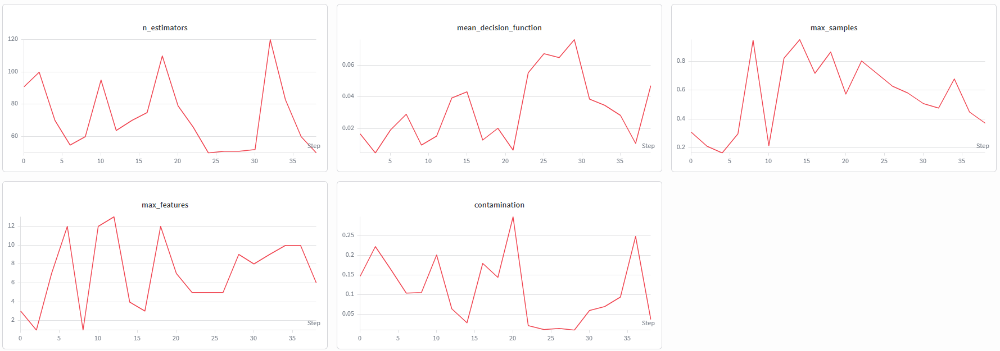
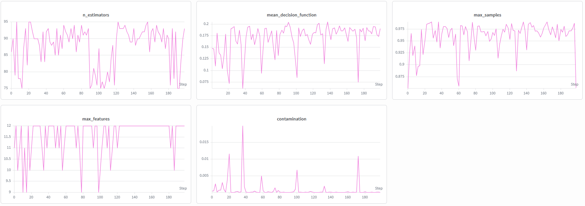

# Predictive Maintenance for Sensors
## Introduction
Temperature data taken hourly using multiple sensors is available for 20 years in a single geographical location. The idea of multiple sensors is actually about the sensors replaced in either usual maintenance cycle or hardware failure. Neither, it is just a single data value of temperature for that single location. First, any anomalies are hunted during the exploratory phase. After that, a baseline weather data is trained in deep learning algorithms, ultimately providing us the model to be deployed in the edge. Model development is in Python for faster iteration, whereas edge deployment is carried out in C++ to handle latency.
## Isolation Forest
Isolation Forest is one of the best classical Machine Learning (ML) algorithm in order to hunt for anomalies. In order to hunt for anomalies, a multi-stage Bayesian optimization process is conducted to move from broad initial exploration to a converged "Search Space" as given in the table below:
| Phase        | Trials | Strategy               | Result                                                         |
|--------------|--------|------------------------|----------------------------------------------------------------|
| Initial Exploration  | 20     | Random/Bayesian Search | Identified high sensitivity in contamination.                  |
| Refinement   | 100+   | Narrowed Bounds        | Converged on max_samples > 0.9 and contamination < 0.005.      |

Please find the graphs below that explain the initial exploration and the last refinement processes. In Figure 1, contamination is seen as the most sensitive parameter which is causing the decision function to be unresponsive as observed in their compatibly mirroring behavior. max_features and max_samples seem to be moving in a trend. n-estimators is also trying to wobble in the search space. Hence, we focus on our attention to the contamination parameter and proceeded with iterative refining. As in Figure 2, contamination always hugged the bottom floor indicating that there is little to no anomaly here. This actually was expected for this dataset because modern sensors can sample data in sub second timings. We have the data taken at every hour, which actually is already averaged and presented to us beforehand. Hence, the expectation of little to no anomaly is real. We implemented a final tuned configuration and observed each anomaly manually and found that they present themselves as a smooth data continuously moving from one hour to the other. This Isolation Forest step has been done for sanity check just in case we could catch some anomalies. It has been proved that the data is clean and can be utilized as the ground truth baseline weather in the next step.



**Figure 1:** Initial Exploration.



**Figure 2:** Final Refinement Step.


#### Final Tuned Configuration in Isolation Forest

```python
optimized_params = {
    "n_estimators": 88,
    "max_samples": 0.96,
    "max_features": 12,
    "contamination": 0.0015,  # Validated against smoothed hourly logs
    "random_state": 42
}
```
