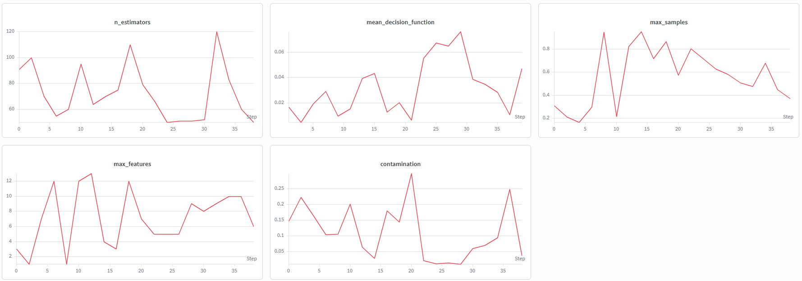
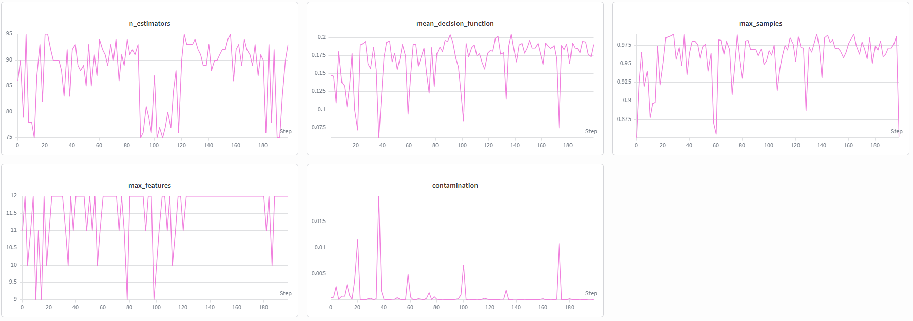

# Predictive Maintenance for Sensors
## Introduction
Our motto is to develop a model that can help us in the early detection of sensor failure and temperature forecasting. Temperature data (main/data/raw/training_data.csv) taken hourly using multiple sensors is available for 20 years in a single geographical location. The idea of multiple sensors is actually about the sensors replaced in either usual maintenance cycle, or hardware failure. Neither, it is just a single data value of temperature for that single location. First, any anomalies are hunted during the exploratory phase. After that, a baseline weather data is trained in Deep Learning (DL) algorithms, ultimately providing us the model to be deployed in the edge. Model development is in Python for faster iteration, whereas edge deployment is carried out in C++ to handle latency.
## Isolation Forest
Isolation Forest (IsoFor) is one of the best classical Machine Learning (ML) algorithm in order to hunt for anomalies. A multi-stage Bayesian Optimization (BayOpt) process utilizing Optuna library (main/training/hyperparameterOpt.py) is conducted to move from broad initial exploration to a converged "Search Space" as given in the table below:
| Phase        | Trials | Strategy               | Result                                                         |
|--------------|--------|------------------------|----------------------------------------------------------------|
| Initial Exploration  | 20     | Random/Bayesian Search | Identified high sensitivity in contamination.                  |
| Refinement   | 100+   | Narrowed Bounds        | Converged on max_samples > 0.9 and contamination < 0.005.      |

### Feature Engineering
Instead of using only one feature of temperature, we included many other features deriving from the time stamps. The sine and cosine of the hours, days, and months created a circular feature easier for the model to capture the behavior of the anomaly. Similarly, we also created rolling means and standard deviations of temperatures in 3 hour, 6 hour, 24 hour, and one week time frames. We also calculated the velocity/slope and acceleration of temperature of different time frames. Finally, we also included temperature deviation from 24 hour rolling mean, repeat counts, and difference from the last hour. The details can be found inside main/training/isolationForest.py. Using a multi-variate feature search-space helps in developing robust algorithm.
### The Findings
wandb is utilized in experiment tracking. Please find the graphs below that explain the initial exploration and the last refinement processes. In Figure 1, contamination is seen as the most sensitive parameter which is causing the decision function to be unresponsive as observed in their compatibly mirroring behavior. max_features and max_samples seem to be moving in a trend. n-estimators is wobbling in the search space. Hence, we focus on our attention to the contamination parameter and proceeded with iterative refining. As in Figure 2, contamination always hugged the bottom floor indicating that there is little to no anomaly here. This is expected for this dataset because modern sensors can sample data in sub-second timings. We have the data presented at every hour, which is already averaged beforehand. Hence, the expectation of little to no anomaly is real. However, if the data is available for sub-second timings coming from a sensor, we could potentially catch some spurious data as anomalies. We implemented a final tuned configuration as given below in IsoFor using main/training/isolationForest.py. After observing each anomaly manually, 264 in number present at main/data/processed/anomalies_0.csv, it is found that they present themselves as a smooth data point continuously moving from one hour to the other in the spatio-temporal space. This IsoFor step provides a sanity check to detect anomalies that might otherwise go unnoticed. It has been proved that the data is clean, and can be utilized as the ground truth baseline weather in the next DL step.



**Figure 1:** Initial Exploration.



**Figure 2:** Final Refinement Step.


#### Final Tuned Configuration in Isolation Forest

```python
optimized_params = {
    "n_estimators": 88,
    "max_samples": 0.96,
    "max_features": 12,
    "contamination": 0.0015,  # Validated against smoothed hourly logs
    "random_state": 42
}
```

## Variational Auto-Encoder (VAE) with Prognostic Axon (VAPA)
### Why VAE?
Classical ML models such as Support Vector Machine (SVM) and IsoFor, implemented above, are only able to detect anomaly but can't forecast. They calculate on the basis of how far a value is in the feature landscape and treat each event as a separate incident completely ignoring the chronology. Similarly, Classical Time-Series Forecasting algorithms such as AutoRegressive Integrated Moving Average (ARIMA) & Prophet treat daily, weekly, and seasonal cycles as a linear function and totally ignore the multi-variate complex non-linear interplay of weather observations. Likewise, DL algorithms such as Long Short-Term Memory Network (LSTM) and Gated Recurrent Unit (GRU) are highly susceptible to the noise in the data and focus only on raw prediction. Hence, we have chosen VAE for accomplishing our tasks because it weeds out the noise in the data and compresses all the complex weather interplay in a robust latent space closely reconstructing the original input and calculating the downstream task of temperature prediction.
### The Pipeline
The pipeline that we chose has been shown graphically below at Figure 3. Our model (main/training/model.py) is based on VAE which extracts deep spatio-temporal representations of the raw temperature observations stemming from the complex weather phenomenon. The algorithm development process begins from the feature engineering for VAE pipeline which is similar to the discussion of IsoFor above. Details can be found at main/training/featureEngineering.py. We performed hyperparamter tuning using BayOpt approach and experiment tracking as in IsoFor above. For compressing the raw data into the latent representation in the reconstruction task axon, we were mainly interested in the optimization of Latent Dimension ([2, 4, 8, 16]), Learning Rate (1e-4 – 1e-2), Beta (0.1, 1.0, step=0.1)) factor between Mean Square Error (MSE) and Kullback–Leibler Divergence (KLD) losses, Activation Functions (["ReLU", "LeakyReLU", "ELU", "Tanh"]), Dropout ([None, 0.1, 0.2]), and Hidden Layer choices ([[32, 16], [64, 32], [64, 32, 16]]). The fully optimized result is given below:
Best Trial Hyperparameters:
  - latent_dim: 8
  - learning_rate: 0.0032858256336512834
  - beta: 0.1
  - activation: ELU
  - dropout: None
  - hidden_layers: [32, 16]

Similarly, for the predictive task axon, we utilized the latent space output from the reconstruction branch of the axon. Our optimized choice for predictive branch is:
Best Trial Hyperparameters:
  - learning_rate: 0.00528172817954173
  - activation: LeakyReLU
  - dropout: 0.1
  - hidden_layers: [32]

During the training phase, we utilized one year of data (main/data/raw/validation_data.csv) for the validation purpose. Similarly, testing is done in roughly 5 months of data (main/data/raw/validation_data.csv).
### Pipeline Architecture

```text
      [ Raw Input Data ]  (Features, Lagged Variables, Rolling Windows)
               │
               ▼
   ┌───────────────────────┐
   │  VAE BACKBONE (Soma)  │  --> Extracts deep spatial-temporal representations
   └───────────┬───────────┘
               │
               ▼
      [ Latent Space (μ) ]      --> Compressed probabilistic normal distribution
               │
               ▼
   ┌───────────────────────┐
   │    PROGNOSTIC AXON    │  --> Decodes representation down downstream tasks
   └─────┬───────────┬─────┘
         │           │
         ▼           ▼
   ┌───────────┐┌───────────┐
   │ Forecast  ││Diagnostic │
   │  Branch   ││  Branch   │
   └─────┬─────┘└─────┬─────┘
         │           │
         ▼           ▼
     [ 72.4°F ]  [ Normal/Spike/Drift/Flatline ]
```
**Figure 3:** Graphical Representation of the pipeline.

### The Findings
During the training and validation phase in the BayOpt process at our **Diagnostic Branch** carried out using main/training/vae.py, we saved the ONNX model exports and scalers at main/data/model for further implementations downstream. After the training and validation phase, we went to test our algorithm using main/testing/test_vae.py. We obtained the Median of MSE and Mean Absolute Deviation (MAD) values to be 0.020700 and 0.006850 respectively. Further, we have artifically injected flatline, some NaNs, and a huge spike. The NaN values are imputated by bringing the same temperature value over three hours and interpolating if more than three hours of data are absent. After the test, we have been able to determine threshold for various diagnostic measures as given below. One can utilize their own dataset and develop their own thresholds for the deployment:
| Alert Tier | Statistical Boundary | Concrete Operational Limit | Production Engine Status & Meaning |
| :--- | :--- | :--- | :--- |
| 🟢 **System Normal** | $\le \text{Median} + (3 \times \text{MAD})$ | $\le 0.04125$ | **HEALTHY:** Ideal, expected cyclic operational patterns. |
| ⚪ **System Buffer** | $> 3 \times \text{MAD}$ up to $\le 4 \times \text{MAD}$ | $> 0.04125$ and $\le 0.04810$ | **HEALTHY (High Volatility):** Normal environmental noise, weather transitions, or minor sensor fluctuations. No alert triggered. |
| 🟡 **Warning** | $> \text{Median} + (4 \times \text{MAD})$ | $> 0.04810$ | **ALERT TRIGGERED:** Pattern disruption confirmed. Evaluates for Sensor Flatlines or Drift. |
| 🔴 **Critical** | $> \text{Median} + (20 \times \text{MAD})$ | $> 0.15770$ | **ALERT TRIGGERED:** Catastrophic system shock or immediate hardware failure. |

On the other hand, within **Forecast Branch** (main/testing/test_forecaster.py), calculated Mean Absolute Error (MAE), Root MSE (RMSE), and R² score (Coefficient of Determination) were utilized to compare against The Naïve Persistence Model (This is a simple model where we project the forecasting temperature is exactly what is there one hour ago.) The results are:
| Metric | This VAPA Model | Naïve Persistence Model | Relative Performance |
| :--- | :---: | :---: | :---: |
| **Mean Absolute Error (MAE)** | 1.458618 | 2.218092 | VAPA outperforms by ~34.2% |
| **Root Mean Squared Error (RMSE)** | 1.458618 | 2.785078 | VAPA outperforms by ~47.6% |
| **Coefficient of Determination ($R^2$)** | 0.156438 | -0.342538 | VAPA explains variance; Naïve fails |
#### Metric Explanations

***1. Mean Absolute Error (MAE)***
* **Baseline:** `1.458618`
* **Persistence:** `2.218092`
* **Interpretation:** On average, VAPA model's predictions are closer to the actual values than the persistence model. A lower MAE indicates better average accuracy.

***2. Root Mean Squared Error (RMSE)***
* **Baseline:** `1.458618`
* **Persistence:** `2.785078`
* **Interpretation:** The VAPA model significantly reduces larger errors compared to the persistence model.

***3. Coefficient of Determination ($R^2$)***
* **Baseline:** `0.156438`
* **Persistence:** `-0.342538`
* **Interpretation:** This VAPA model explains approximately **15.64%** of the variance in the target variable. In traditional regression, this looks modest. However, in raw environmental sensor streams, high-frequency noise—like wind gusts or momentary direct sunlight—creates chaotic variance. Our framework deliberately filters out this micro-noise to capture macro-trends. The fact that we drastically beat the naïve persistence baseline confirms our model is capturing the true structural signal. The negative $R^2$ score for the naïve persistence model implies that predicting using pure persistence performs worse than a horizontal line representing the mean of the dataset. This demonstrates that while 0.156 seems low R² score in a vacuum, it represents a massive performance leap over simple data shifting.
